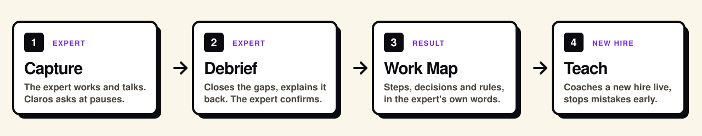
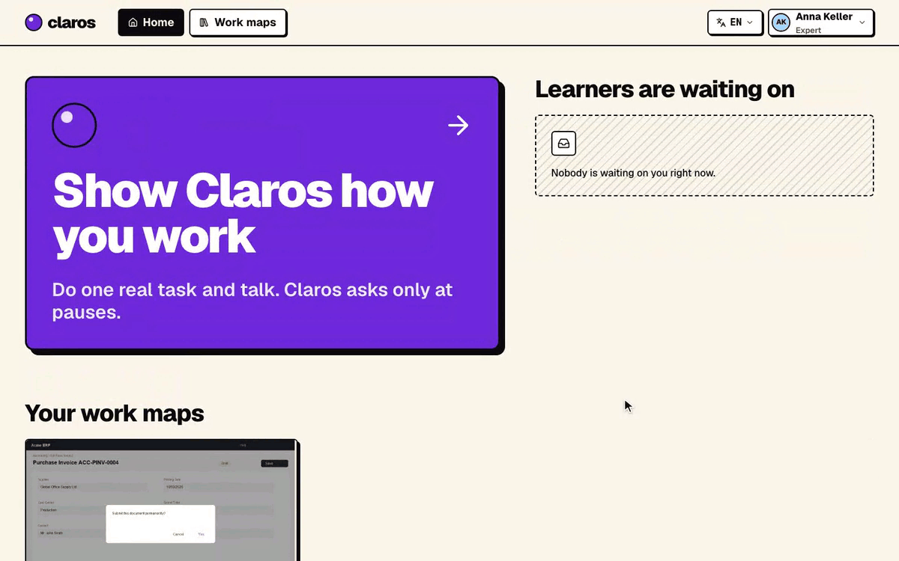
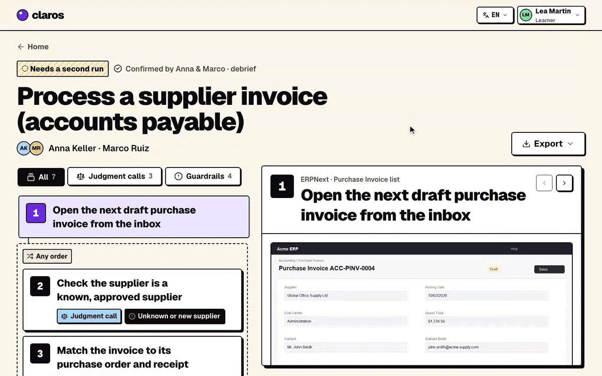
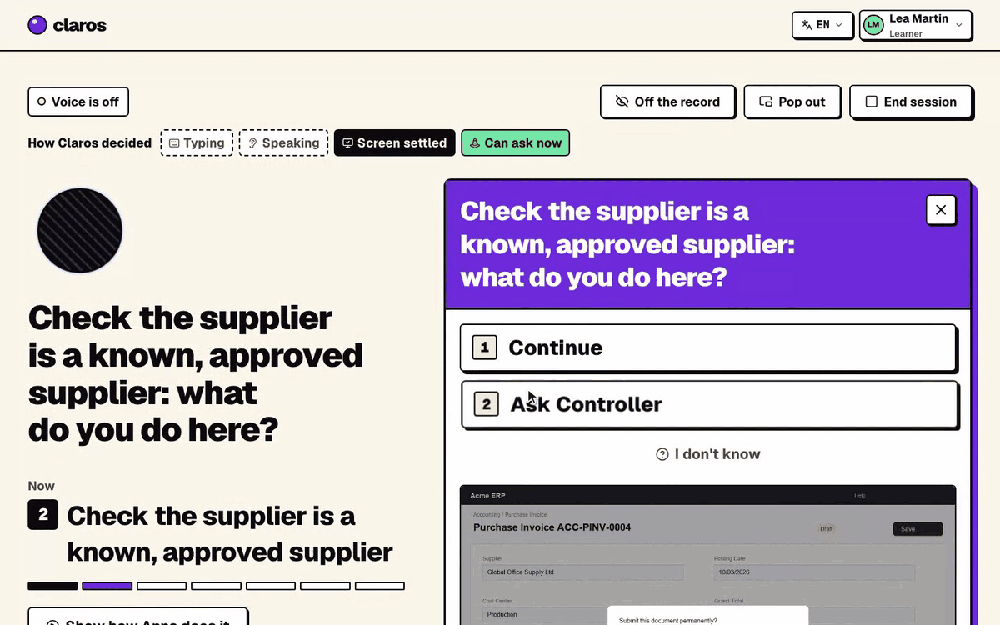

<p align="center">
  
</p>

<p align="center">
  <a href="https://claros-eta.vercel.app"></a>
  
  
  <a href="LICENSE"></a>
</p>

# Claros

**A voice apprentice that learns how your best people work — and teaches it to the next person.**

An expert shares their app window and does real work while talking. Claros stays quiet while they type, asks short questions at natural pauses (*"You moved that one to capex — what made you do that?"*), runs a short spoken debrief, and turns the session into a **Work Map**: every step, judgment call and guardrail, linked to the screen moment and the expert's own words. A new hire then works a real case on their own screen while Claros coaches them by voice and stops them *before* they break a rule.

Built for the ElevenLabs × Hack-Nation challenge *The AI Apprentice*.

- **Live:** [claros-eta.vercel.app](https://claros-eta.vercel.app)
- Works on any desktop web or windowed app — no integration, it reads the screen. Tested on ERPNext and Zammad.
- Voice in English, German, French, Spanish and Russian.

---

## How it works

<p align="center"></p>

**Expert — one sitting, about 10–15 minutes**

1. **Capture.** Press Start, share one window, talk while you work. Claros asks 3–5 questions at pauses, about what's on screen — what you changed, a limit, when you'd stop and ask someone. Anything it can look up itself (app docs, general knowledge, O\*NET task data) it doesn't ask.
2. **Debrief.** Claros asks about what's still unclear, explains the whole process back in under a minute, and you correct or confirm it.
3. **Work Map.** The result: a clickable timeline of steps, decisions, reasons and guardrails, each tied to its screen moment.

<p align="center"></p>

**New hire — live, on a real case**

Press Start and say what you're working on. Claros recognizes the workflow, explains each step the way the expert did, asks you to predict the next decision (answer by voice, click, or just do it), and steps in before a guardrail is broken — showing the expert's screen moment and quote. If the workflow has never been recorded, it says so and offers to ask an expert.

| The expert's Work Map | A new hire, coached live |
|---|---|
|  |  |

**Trust.** Claros only sees the window you choose. Say *"off the record"* to pause watching and listening (tap Resume to continue); say *"strike that"* to delete the last 30 seconds. Personal data on screen is blurred before any model sees it.

## Architecture

```
Browser (Next.js on Vercel)
  window capture → on-device change detection → keyframes ──┐
  ElevenLabs voice session (WebRTC) + floating companion     │ WebSocket
                                                              ▼
Server (FastAPI on Render)
  redact (RapidOCR + GLiNER2-PII) → read screen (GLM-5.3-Flash) → events
  unknowns ledger → pause gate → question → ElevenLabs agent speaks it
  map builder · debrief · tutor (guardrail checks before submit)
```

| Layer | Choice |
|---|---|
| Live dialog | ElevenLabs Agents — hosted Gemini 3.6 Flash, `eleven_v4_turbo` voice, Scribe turn-taking |
| Screen reading & writing | GLM-5.3-Flash via Isoquant |
| Fast decisions (ask now? which intent? rule broken?) | Clef-flash (Cloudflare Workers AI / local Ollama), Fastino GLiDE |
| Lookups instead of asking | Exa, Crawl4AI, Bright Data SERP, O\*NET 31.0 |
| Retrieval | Jina embeddings + reranker |
| Privacy | RapidOCR + GLiNER2-PII, redaction before any model call |
| Storage | SQLite (FTS5 + sqlite-vec) |
| Frontend | Next.js, Tailwind, [neobrutalism.dev](https://www.neobrutalism.dev) components |

The server decides *what* to say and *when*; the ElevenLabs agent says it. Control (pause detection, off the record, phase changes) never depends on the LLM.

## Run it locally

**Requirements:** macOS or Linux, Python 3.11 + [uv](https://docs.astral.sh/uv/), Node 20+ + pnpm, Chrome or Edge (screen capture and the floating companion are Chromium-only).

```bash
git clone https://github.com/beartackler/claros && cd claros
cp .env.example .env        # fill in keys (below)
make sync                   # server deps
cd web && pnpm install && cd ..

make server                 # API on :8787
make web                    # app on :3000
```

Open http://localhost:3000. Keys in `.env`:

| Key | Needed for |
|---|---|
| `ELEVENLABS_API_KEY`, `ELEVENLABS_AGENT_ID` | voice (required) |
| `ISOQUANT_API_KEY` | screen reading and text (required; `OPENROUTER_API_KEY` / `GEMINI_API_KEY` as fallbacks) |
| `JINA_API_KEY` | embeddings and reranking |
| `EXA_API_KEY`, `BRIGHTDATA_API_KEY` | looking things up instead of asking |
| `CLOUDFLARE_ACCOUNT_ID`, `CLOUDFLARE_API_TOKEN`, `FASTINO_API_KEY` | decision models (optional; falls back to the LLM, then rules) |

Every component degrades gracefully when its key is missing.

### Fast decisions on your own machine (optional)

Claros makes many small, frequent decisions: is this edit a judgment call, what did the person just say, how welcome would a question be right now. You can run them locally on [Ollama](https://ollama.com), so they stay on your machine, cost nothing and skip a network hop:

```bash
brew install ollama        # or download it from ollama.com
ollama pull clef-flash     # the decision model, a ~10 GB download
ollama serve               # serves the System One API on :11434
```

Keep `OLLAMA_URL=http://localhost:11434` in `.env` (it's already in `.env.example`). Check that it answers:

```bash
curl -s localhost:11434/v1/systemone -H 'content-type: application/json' -d '{"model":"clef-flash",
  "state":{"utterance":"off the record please"},
  "questions":{"intent":{"type":"choice","instructions":"Classify the utterance",
  "criteria":{"off_record":"wants to pause recording","other":"anything else"}}}}'
```

Ollama is tried first. When it isn't running, Claros moves on to Cloudflare Workers AI, then Fastino GLiDE, then the main LLM, then plain rules, so a decision always comes back. `CLAROS_DECIDER_OLLAMA=0` skips Ollama; `CLAROS_DECIDER_MODEL` picks a different local model.

### Test apps

Claros doesn't need these — it works on whatever window you share — but they give you realistic, resettable data:

```bash
colima start                                   # or Docker Desktop
cd infra/erpnext && docker compose up -d       # ERPNext on :8080
python seed.py                                 # fake accounts-payable data
./reset.sh snapshot                            # save; ./reset.sh restore between runs
```

Logins and the second test app (Zammad, support escalation) are in [`infra/README.md`](infra/README.md).

## Repository

```
server/   FastAPI app — perception, brain (ledger, pause gate, dialog), knowledge (map, debrief, tutor), context tools
web/      Next.js app — capture, debrief, Work Map, live learner session
agents/   ElevenLabs agent config (pushed with the ElevenLabs CLI)
infra/    ERPNext and Zammad test beds, end-to-end harness, evals
docs/     product spec, contracts, deploy notes, evals
```

More detail: [product](docs/PRODUCT.md) · [contracts](docs/CONTRACTS.md) · [deploy](docs/DEPLOY.md) · [evals](docs/EVALS.md)

```bash
make test                   # server test suite
```

## Status

Hackathon prototype. The full capture → debrief → map → teach loop runs end to end on real ERPNext screens; evals and known limitations are in [docs/EVALS.md](docs/EVALS.md).

## License

[MIT](LICENSE) © 2026 Timur Monasypov.

O\*NET 31.0 Database by USDOL/ETA, used under CC BY 4.0.
